<!--
  Junn4423 // Cyber HUD GitHub Profile
  Keep the pjunn4423 profile-view counter intentionally.
-->

<p align="center">
  
</p>

<p align="center">
  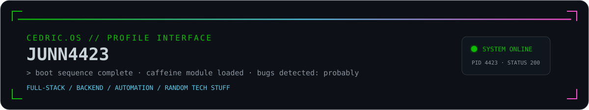
</p>

<p align="center">
  
  
  
  
</p>

<div align="center">
  
</div>

<br>

<p align="center">
  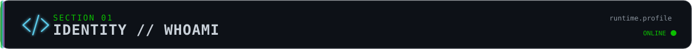
</p>

```ts
const cedric = {
  username: "Junn4423",
  mode: "build → break → debug → repeat",
  interests: ["Full-stack", "Backend", "Automation", "Random Tech Stuff"],
  languages: ["JavaScript", "TypeScript", "C#", "Java", "Python", "C", "C++", "Lua"],
  fuel: "coffee",
  currentProcess: "probably debugging something that worked yesterday",
  rule: "If it works on my machine, ship the machine."
} as const;
```

<br>

<p align="center">
  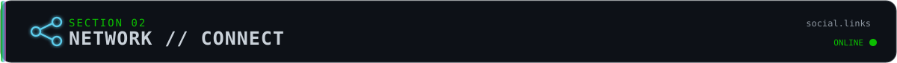
</p>

<p align="center">
  <a href="https://www.facebook.com/junloun4423">
    
  </a>
  <a href="https://www.instagram.com/jun.loun/">
    
  </a>
  <a href="https://www.linkedin.com/in/l%C6%B0%C6%A1ng-ng%E1%BB%8Dc-chung-405919290">
    
  </a>
  <a href="https://github.com/Junn4423">
    
  </a>
</p>

<br>

<p align="center">
  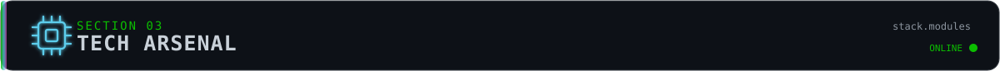
</p>

<div align="center">
  <table>
    <tr>
      <td valign="top" width="33%">
        <h3 align="center">FRONTEND</h3>
        <div align="center">
          
        </div>
      </td>
      <td valign="top" width="33%">
        <h3 align="center">BACKEND / LANG</h3>
        <div align="center">
          
        </div>
      </td>
      <td valign="top" width="33%">
        <h3 align="center">DATA / TOOLS</h3>
        <div align="center">
          
        </div>
      </td>
    </tr>
  </table>
</div>

<p align="center">
  
  
  
  
  
  
  
</p>

<br>

<p align="center">
  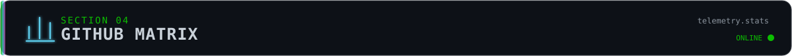
</p>

<p align="center">
  
  
</p>

<p align="center">
  
</p>

<!-- Animated chart cards: pure SVG/CSS animation served by GitHub Profile Summary Cards -->
<p align="center">
  
</p>

<p align="center">
  
  
</p>

<br>

<p align="center">
  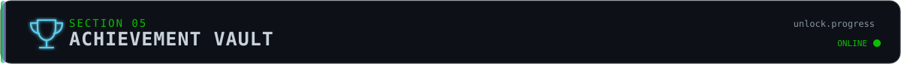
</p>

<p align="center">
  <a href="https://github.com/ryo-ma/github-profile-trophy">
    
  </a>
</p>

<p align="center">
  
  
  
</p>

<br>

<p align="center">
  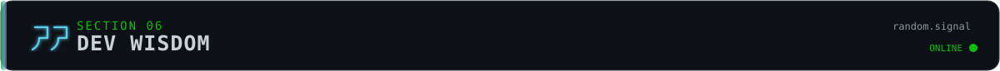
</p>

<p align="center">
  
</p>

<br>

<p align="center">
  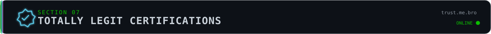
</p>

<div align="center">
  
  
  
  <br>
  
  
  
</div>

<br>

<p align="center">
  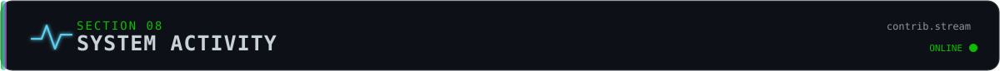
</p>

<p align="center">
  <code>snake.feed(contributions)</code>
</p>

<p align="center">
  <picture>
    <source media="(prefers-color-scheme: dark)" srcset="https://raw.githubusercontent.com/Junn4423/Junn4423/output/github-contribution-grid-snake-dark.svg">
    <source media="(prefers-color-scheme: light)" srcset="https://raw.githubusercontent.com/Junn4423/Junn4423/output/github-contribution-grid-snake.svg">
    
  </picture>
</p>

<details>
  <summary><b>OPEN // 3D CONTRIBUTION MATRIX</b></summary>
  <br>
  <p align="center">
    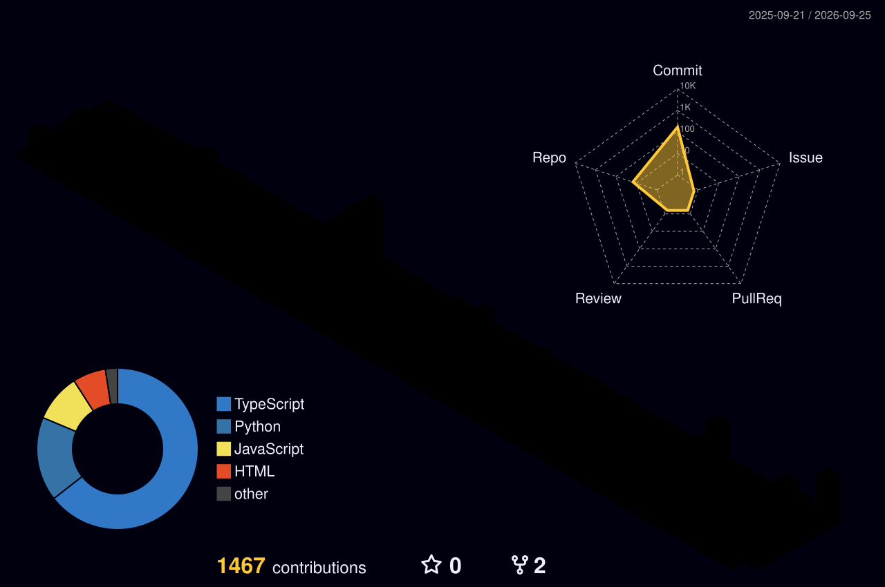
  </p>
</details>

<br>

<p align="center">
  
</p>

<br>

<p align="center">
  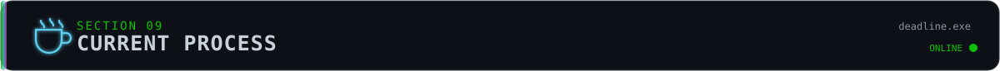
</p>

```js
while (deadline.approaching()) {
  coffee++;
  sleep--;
  bugs.rename("features");
  code();
}
```

<div align="center">
  
</div>

<p align="center">
  
  
  
</p>

<br>

<p align="center">
  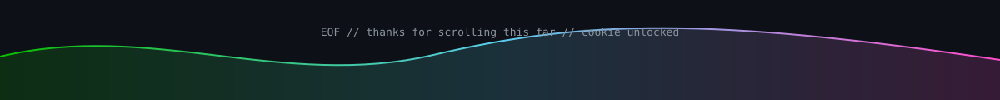
</p>

<p align="center">
  <sub><code>return 0;</code> // made with questionable decisions and enough caffeine</sub>
</p>
